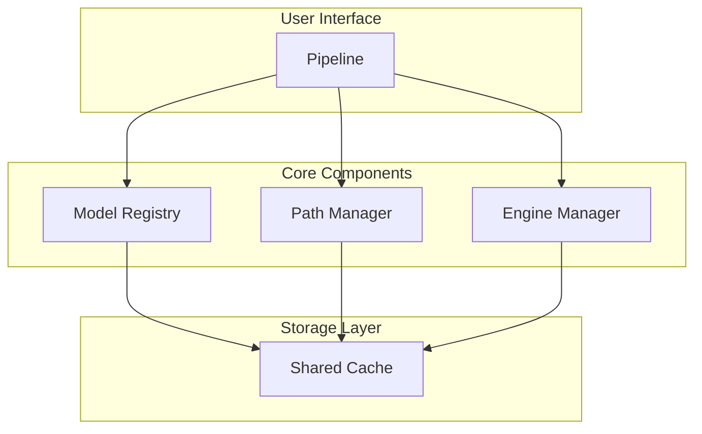

# TensorRT Demos

A collection of demos for TensorRT-RTX.

# License
```
Copyright (c) 2025 NVIDIA CORPORATION & AFFILIATES. All rights reserved.

Licensed under the Apache License, Version 2.0 (the "License");
you may not use this file except in compliance with the License.
You may obtain a copy of the License at

    http://www.apache.org/licenses/LICENSE-2.0

Unless required by applicable law or agreed to in writing, software
distributed under the License is distributed on an "AS IS" BASIS,
WITHOUT WARRANTIES OR CONDITIONS OF ANY KIND, either express or implied.
See the License for the specific language governing permissions and
limitations under the License.
```

## Features

- **Smart Caching**: Shared models across pipelines with intelligent cleanup
- **Cross-Platform**: Works on Windows and Linux
- **Flexible Precision**: Configure precision per model
- **Memory Management**: Multiple memory modes for different VRAM constraints
- **Engine Compatibility**: Automatic rebuilding only when needed
- **Dynamic Shapes**: Support for dynamic shapes and shape specialization


## Architecture



### Component Responsibilities

| Component | Purpose | Key Features |
|-----------|---------|--------------|
| **Model Registry** | Model definitions and configurations | Pipeline composition, precision defaults, ONNX sources |
| **Path Manager** | File operations and cache management | Shared storage, cleanup policies, path resolution |
| **Engine Manager** | TensorRT engine lifecycle | Building, loading, compatibility checking, resource allocation |
| **Pipeline** | User interface and orchestration | Simple API, state management, inference coordination |

## Cache Structure

The system uses a **shared cache architecture** where all models are stored centrally by `model_id` and `precision`. Here's exactly what gets stored where:

```
demo_cache/
├── shared/
│   ├── onnx/                         # ONNX models storage
│   │   └── {model_id}/
│   │       └── {precision}/
│   │           ├── {model_id}.onnx           # Main ONNX file
│   │           └── {model_id}.onnx.data      # External data (if exists)
│   │
│   └── engines/                      # TensorRT engines & metadata storage
│       └── {model_id}/
│           └── {precision}/
│               ├── {model_id}.engine         # TensorRT engine file
│               └── {model_id}.metadata.json  # Engine compatibility metadata
│
└── .cache_state.json                # Pipeline usage tracking for cleanup
```

## Installation

1. **Clone repository**
   ```bash
   git clone https://github.com/kevren-nvidia/TensorRT-RTX.git --branch dev-kevren-ltx-video-2b-txt2vid --single-branch
   cd TensorRT-RTX/demo
   ```

2. **Install dependencies**
   ```bash
   python -m pip install /path/to/tensorrt-rtx/python/tensorrt_rtx-${version}-cp${py3-ver}-none-${os-ver}_x86_64.whl
   python -m pip install -r requirements_demo.txt
   ```

3. **Set model locations**

   Open utils/model_registry.py and set ONNX model paths for T5 encoder, VAE encoder/decoder, and the bf16/fp8 transformers.

4. **Run example**
   ```bash
   python examples/run_ltx_video.py
   ```

## Configuration

### Memory Modes

| Mode | Behavior | Use Case |
|------|----------|----------|
| `normal` | Keep all models in VRAM simultaneously | Fastest inference, requires most VRAM |
| `t5_offload` | Offload text encoder to CPU when not needed | Balanced performance and memory usage - LTX-Video ONLY |
| `low_vram` | Just-in-time loading, unload models between steps | Limited VRAM systems, slower but memory efficient |

```python
# High performance setup (requires more VRAM)
pipeline = VideoPipeline(memory_mode="normal")

# Balanced setup (moderate VRAM usage) [LTX-Video ONLY]
pipeline = VideoPipeline(memory_mode="t5_offload")

# Low VRAM setup (minimal memory usage)
pipeline = VideoPipeline(memory_mode="low_vram")
```

### Cache Modes

| Mode | Behavior |
|------|----------|
| `full` | Keep all cached models |
| `lean` | Clean up unused models |

### Dynamic Shapes

The system supports both static and dynamic shape profiles for TensorRT engines:

```python
# Static shapes (faster, fixed dimensions)
pipeline.load_engines(
    opt_height=512, opt_width=704, opt_num_frames=161,
    static_shape=True  # Default
)

# Dynamic shapes (flexible, multiple resolutions)
pipeline.load_engines(
    opt_height=512, opt_width=704, opt_num_frames=161,
    static_shape=False  # Enables min/opt/max profiles
)
```

In TRT-RTX, **dynamic shape specialization** enables the speed of static shapes while allowing for runtime flexibility by compiling fast kernels for observed input shapes in the background, then intelligently swapping these into the runtime.

### Precision Configuration

```python
# Example precision configuration
precision_config = {
    "text_encoder": "bf16",
    "transformer": "fp8",
    "vae_decoder": "fp16",
}
```

## Examples

### Basic Text-to-Video

```python
pipeline = VideoPipeline(pipeline_type="txt2vid")
pipeline.load_engines()
pipeline.activate_engines()
pipeline.load_resources(height=512, width=512, num_frames=161)

video = pipeline.run_demo(
    prompt="A serene lake at sunset",
    guidance_scale=3.0,
    num_inference_steps=50
)
```

### Low VRAM Configuration

```python
pipeline = VideoPipeline(
    memory_mode="low_vram",
    precision_config={
        "text_encoder": "bf16",
        "transformer": "bf16",
        "vae_decoder": "fp16"
    },
    cache_mode="lean"
)
```

## Engine Compatibility

The system automatically handles engine compatibility through metadata tracking:

- **ONNX Hash**: Detects model changes requiring rebuild
- **Shape Profiles**: Validates input/output dimensions
- **Precision Settings**: Ensures correct data types
- **Build Configuration**: Tracks optimization settings

Engines are rebuilt only when necessary, saving time and ensuring reliability.

## Troubleshooting

### Common Issues

1. **GPU Out of Memory**
   - Use `memory_mode="low_vram"` for memory-constrained systems
   - Use `fp8` precision for large models (transformer especially)
   - Reduce batch size, resolution, or number of frames
   - Check GPU VRAM with `nvidia-smi`

2. **Disk Space Issues**
   - Enable `cache_mode="lean"` to auto-cleanup unused models
   - Manually clean cache directory if needed
   - Each engine can be 1-10GB depending on model and precision

3. **Build Failures**
   - Check CUDA compatibility with TensorRT version
   - Verify TensorRT installation
   - Review polygraphy arguments and error messages

4. **Import Errors**
   - Ensure all dependencies are installed
   - Check Python path configuration
   - Verify CUDA environment setup

### Memory Mode Selection Guide

- **Normal Mode**: Use when you have ample VRAM (12GB+) and want maximum speed
- **T5 Offload Mode**: Use with moderate VRAM (8-12GB) for balanced performance - [LTX-Video ONLY]
- **Low VRAM Mode**: Use with limited VRAM (4-8GB) when memory is critical

### Debug Mode

Enable verbose logging for detailed information:

```python
pipeline = VideoPipeline(verbose=True)
```

This provides insight into:
- Engine building and loading
- Memory allocation and deallocation
- Cache operations
- Compatibility checking
- Memory mode transitions
